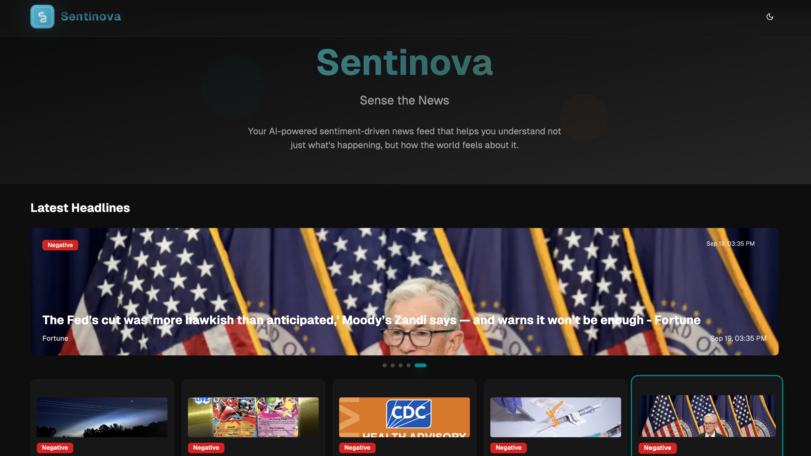
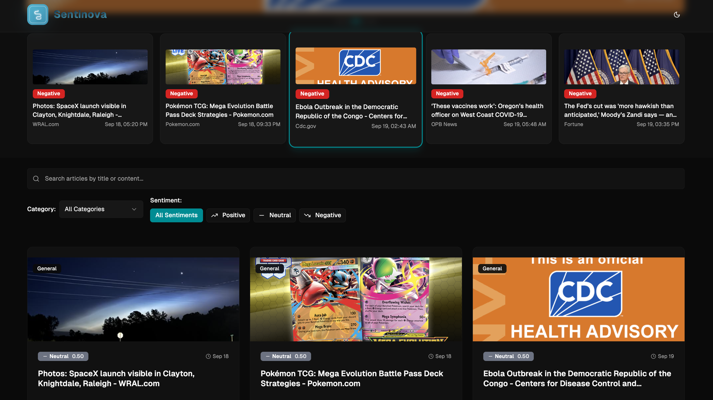
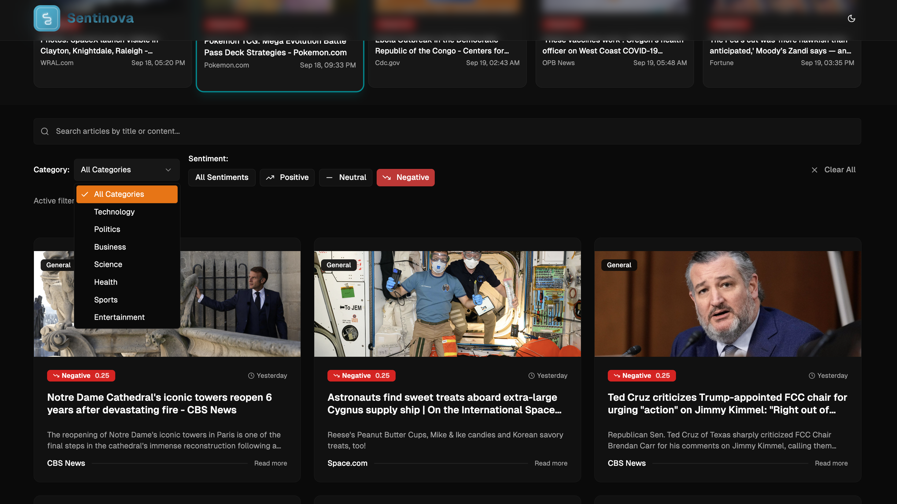

# 📰 SENTINOVA – Sense The News  

  
  
  
  
  

---

## ✨ About  

**SENTINOVA** is not just a news app.  
It’s an **AI-powered intelligence platform** redefining how we consume, analyze, and act on information.  

🌍 The world is drowning in headlines.  
🧠 SENTINOVA transforms raw data into **actionable insights**.  
⚡ News that doesn’t just inform — it **empowers**.  

---

## 🚀 Core Highlights  

- 🔎 **Live Web Scraping** — JSoup-powered, real-time content extraction  
- 🧠 **Deep NLP Analysis** — Stanford CoreNLP + Apache OpenNLP  
- ⚡ **Enterprise Backend** — Spring Boot `3.4.9` REST APIs  
- 🗄️ **Secure Storage** — PostgreSQL as the data backbone  
- 🧪 **Proven Reliability** — Postman-tested + Spring Boot Test  
- 🎨 **Luxury Frontend** — Next.js 14 + TailwindCSS 4 + Framer Motion animations  
- 📊 **Interactive Insights** — Recharts, Radix UI, premium design components  

---

## 🛠️ Tech Stack  

| Layer        | Tech                                                                 |
|--------------|----------------------------------------------------------------------|
| **Backend**  | Spring Boot `3.4.9`, Stanford CoreNLP `4.5.5`, Apache OpenNLP `2.3.3`, JSoup `1.17.2` |
| **Database** | PostgreSQL                                                           |
| **Testing**  | Spring Boot Starter Test `3.6.9`, Postman                            |
| **Frontend** | Next.js `14`, React, TailwindCSS `4`, Radix UI, Framer Motion        |
| **Utilities**| Lucide Icons, Geist UI, Sonner, Vaul, React Hook Form + Zod, Date-fns, Recharts, Embla Carousel |

---

## 📂 Project Architecture  

## 🌐 Live Product Preview

**1. Homepage & Headline Sentiment Tags**  

**2. Search, Sentiment & Category Filters**  

**3. Positive News Feed (Green sentiment highlights)**  

**4. Category-based News Filtering (Dropdown example)**  

## 🛢️ Database (PostgreSQL)

**1. Connect & List Relations**  

**2. Tables in Schema**  

**3. Table Schemas (Users / Jobs / Applications)**  

**4. Applications Table Schema**  

**5. Jobs Table Schema**  

## 📬 API Testing (Postman)

**1. Authentication & Login**  

**2. CRUD Job APIs**  

**3. Applications APIs**  

